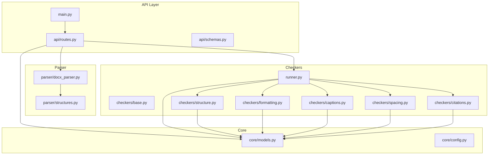
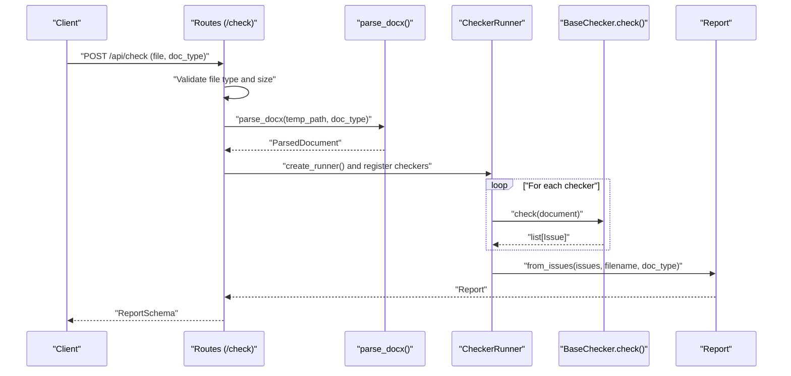
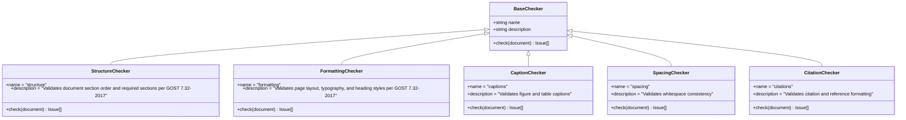
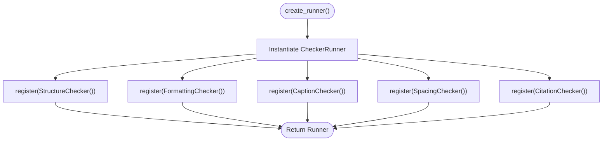
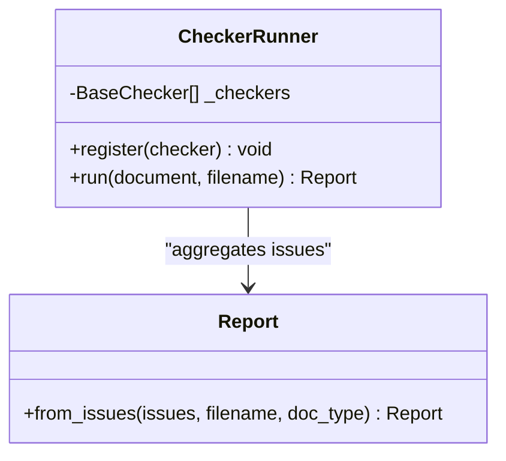
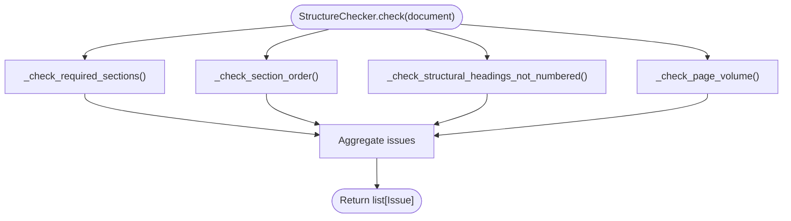
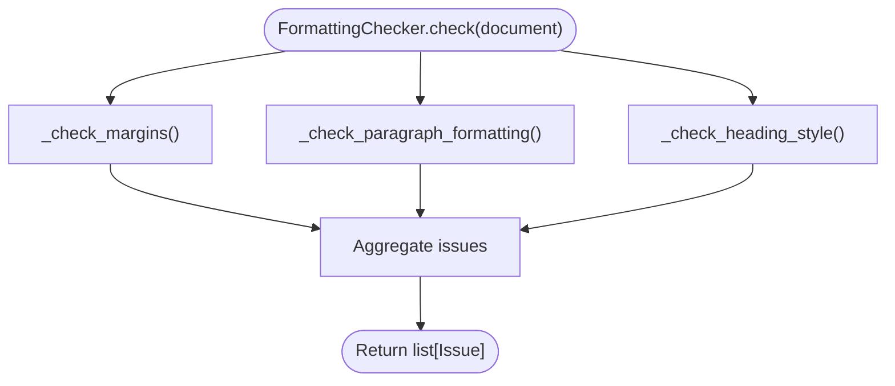
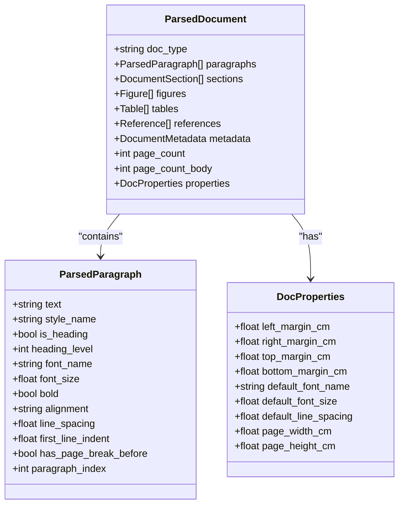
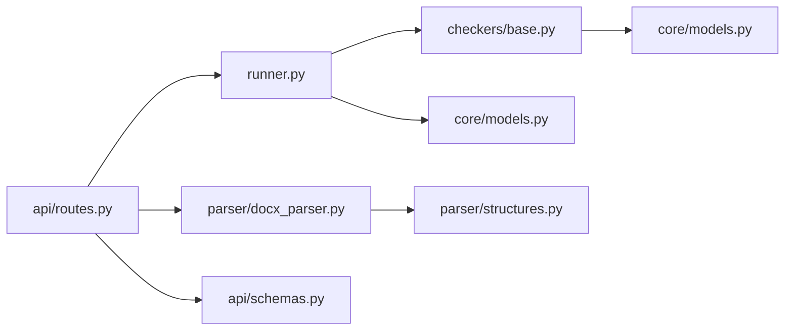

# Validation System

<cite>
**Referenced Files in This Document**
- [base.py](file://backend/app/checkers/base.py)
- [runner.py](file://backend/app/runner.py)
- [routes.py](file://backend/app/api/routes.py)
- [models.py](file://backend/app/core/models.py)
- [schemas.py](file://backend/app/api/schemas.py)
- [structures.py](file://backend/app/parser/structures.py)
- [docx_parser.py](file://backend/app/parser/docx_parser.py)
- [structure.py](file://backend/app/checkers/structure.py)
- [formatting.py](file://backend/app/checkers/formatting.py)
- [captions.py](file://backend/app/checkers/captions.py)
- [spacing.py](file://backend/app/checkers/spacing.py)
- [citations.py](file://backend/app/checkers/citations.py)
- [main.py](file://backend/app/main.py)
- [config.py](file://backend/app/core/config.py)
- [test_structure.py](file://backend/tests/test_structure.py)
- [test_formatting.py](file://backend/tests/test_formatting.py)
</cite>

## Table of Contents
1. [Introduction](#introduction)
2. [Project Structure](#project-structure)
3. [Core Components](#core-components)
4. [Architecture Overview](#architecture-overview)
5. [Detailed Component Analysis](#detailed-component-analysis)
6. [Dependency Analysis](#dependency-analysis)
7. [Performance Considerations](#performance-considerations)
8. [Troubleshooting Guide](#troubleshooting-guide)
9. [Conclusion](#conclusion)
10. [Appendices](#appendices)

## Introduction
This document describes the validation system that enforces GOST 7.32-2017 compliance for academic dissertations. The system is built around a plugin-based checker architecture: a shared BaseChecker interface defines the contract for all validators, a Runner orchestrates checker execution, and individual checkers implement specific validation rules for structure, formatting, captions, spacing, and citations. The system parses DOCX documents into structured data, runs validations, and produces a standardized report with severity levels and categorization.

## Project Structure
The backend is organized into cohesive layers:
- API layer: FastAPI application and route handlers
- Parser layer: DOCX parsing and structured data models
- Core domain: Shared models and configuration
- Checkers: Plugin-based validators implementing BaseChecker
- Runner: Orchestrator that registers and executes checkers

**Diagram sources**
- [main.py:1-20](file://backend/app/main.py#L1-L20)
- [routes.py:1-66](file://backend/app/api/routes.py#L1-L66)
- [runner.py:1-25](file://backend/app/runner.py#L1-L25)
- [base.py:1-17](file://backend/app/checkers/base.py#L1-L17)
- [structure.py:1-148](file://backend/app/checkers/structure.py#L1-L148)
- [formatting.py:1-174](file://backend/app/checkers/formatting.py#L1-L174)
- [captions.py:1-14](file://backend/app/checkers/captions.py#L1-L14)
- [spacing.py:1-14](file://backend/app/checkers/spacing.py#L1-L14)
- [citations.py:1-14](file://backend/app/checkers/citations.py#L1-L14)
- [docx_parser.py:1-238](file://backend/app/parser/docx_parser.py#L1-L238)
- [structures.py:1-89](file://backend/app/parser/structures.py#L1-L89)
- [models.py:1-58](file://backend/app/core/models.py#L1-L58)
- [schemas.py:1-38](file://backend/app/api/schemas.py#L1-L38)
- [config.py:1-17](file://backend/app/core/config.py#L1-L17)

**Section sources**
- [main.py:1-20](file://backend/app/main.py#L1-L20)
- [routes.py:1-66](file://backend/app/api/routes.py#L1-L66)
- [runner.py:1-25](file://backend/app/runner.py#L1-L25)
- [base.py:1-17](file://backend/app/checkers/base.py#L1-L17)
- [docx_parser.py:1-238](file://backend/app/parser/docx_parser.py#L1-L238)
- [structures.py:1-89](file://backend/app/parser/structures.py#L1-L89)
- [models.py:1-58](file://backend/app/core/models.py#L1-L58)
- [schemas.py:1-38](file://backend/app/api/schemas.py#L1-L38)
- [config.py:1-17](file://backend/app/core/config.py#L1-L17)

## Core Components
- BaseChecker: Defines the checker contract with a name, description, and a check method that accepts a parsed document and returns a list of issues.
- CheckerRunner: Maintains a registry of BaseChecker instances and orchestrates validation execution, aggregating results into a Report.
- ParsedDocument and related structures: Provide typed access to document metadata, paragraphs, sections, figures, tables, references, and properties.
- Issue and Report: Define the classification, severity, and reporting model used across all checkers.
- API routes: Parse uploaded DOCX files, construct a ParsedDocument, run the Runner, and return a standardized Report.

Key implementation references:
- BaseChecker interface definition and abstract method
- Runner registration and orchestration
- Issue and Report data models
- Route handler that wires parser, runner, and response schema

**Section sources**
- [base.py:9-17](file://backend/app/checkers/base.py#L9-L17)
- [runner.py:8-25](file://backend/app/runner.py#L8-L25)
- [models.py:9-58](file://backend/app/core/models.py#L9-L58)
- [routes.py:20-66](file://backend/app/api/routes.py#L20-L66)

## Architecture Overview
The validation pipeline follows a clear flow:
1. Client uploads a .docx file via the API.
2. The server saves the file temporarily and parses it into a ParsedDocument.
3. The Runner iterates registered checkers and collects issues.
4. Issues are aggregated into a Report with counts by severity and category.
5. The API responds with a structured Report.

**Diagram sources**
- [routes.py:35-66](file://backend/app/api/routes.py#L35-L66)
- [docx_parser.py:161-238](file://backend/app/parser/docx_parser.py#L161-L238)
- [runner.py:15-25](file://backend/app/runner.py#L15-L25)
- [base.py:13-16](file://backend/app/checkers/base.py#L13-L16)
- [models.py:28-58](file://backend/app/core/models.py#L28-L58)

## Detailed Component Analysis

### BaseChecker Interface
- Purpose: Standardizes the contract for all checkers.
- Responsibilities:
  - Provide human-readable name and description.
  - Implement a check method that takes a ParsedDocument and returns a list of Issue objects.
- Extensibility: New checkers subclass BaseChecker and implement check; they are registered with the Runner to participate in validation.

**Diagram sources**
- [base.py:9-17](file://backend/app/checkers/base.py#L9-L17)
- [structure.py:47-58](file://backend/app/checkers/structure.py#L47-L58)
- [formatting.py:15-25](file://backend/app/checkers/formatting.py#L15-L25)
- [captions.py:8-14](file://backend/app/checkers/captions.py#L8-L14)
- [spacing.py:8-14](file://backend/app/checkers/spacing.py#L8-L14)
- [citations.py:8-14](file://backend/app/checkers/citations.py#L8-L14)

**Section sources**
- [base.py:9-17](file://backend/app/checkers/base.py#L9-L17)

### Checker Registration Mechanism
- The Runner maintains a list of BaseChecker instances.
- The route handler constructs a Runner and registers all active checkers (Structure, Formatting, Captions, Spacing, Citations).
- Registration is centralized in the route factory, enabling easy addition or removal of checkers.

**Diagram sources**
- [routes.py:20-27](file://backend/app/api/routes.py#L20-L27)
- [runner.py:12-13](file://backend/app/runner.py#L12-L13)

**Section sources**
- [routes.py:20-27](file://backend/app/api/routes.py#L20-L27)
- [runner.py:8-13](file://backend/app/runner.py#L8-L13)

### Runner Orchestration System
- Responsibilities:
  - Keep a registry of BaseChecker instances.
  - Execute each checker’s check method with the same ParsedDocument.
  - Aggregate all issues into a single Report via a static factory method.
- Output: A Report containing total counts by severity and category, plus the full issue list.

**Diagram sources**
- [runner.py:8-25](file://backend/app/runner.py#L8-L25)
- [models.py:28-58](file://backend/app/core/models.py#L28-L58)

**Section sources**
- [runner.py:8-25](file://backend/app/runner.py#L8-L25)
- [models.py:28-58](file://backend/app/core/models.py#L28-L58)

### Structure Checker (GOST 7.32-2017 Sec. 6.4)
- Validates:
  - Required sections presence (abstract, contents, introduction, conclusion, references).
  - Section order correctness.
  - Structural headings not being numbered.
  - Minimum page volume thresholds per document type.
- Severity:
  - Errors for missing sections and incorrect ordering.
  - Warnings for structural headings being numbered and low page volume.
- Rule references: Sections 6.2 and 6.4.

**Diagram sources**
- [structure.py:51-57](file://backend/app/checkers/structure.py#L51-L57)

**Section sources**
- [structure.py:47-148](file://backend/app/checkers/structure.py#L47-L148)

### Formatting Checker (GOST 7.32-2017 Sec. 6.2)
- Validates:
  - Margins within tolerance.
  - Paragraph font name and size.
  - Line spacing.
  - Text alignment (should be justified).
  - Heading uppercase, no trailing periods, and bold formatting.
- Severity:
  - Errors for margins, fonts, sizes, spacing, and alignment.
  - Warnings for headings formatting issues.
- Rule references: Section 6.2.

**Diagram sources**
- [formatting.py:19-24](file://backend/app/checkers/formatting.py#L19-L24)

**Section sources**
- [formatting.py:15-174](file://backend/app/checkers/formatting.py#L15-L174)

### Captions, Spacing, and Citations Checkers (Stubs)
- These checkers currently return no issues and are placeholders for future tasks.
- They implement the BaseChecker contract and are registered alongside active checkers.

**Section sources**
- [captions.py:8-14](file://backend/app/checkers/captions.py#L8-L14)
- [spacing.py:8-14](file://backend/app/checkers/spacing.py#L8-L14)
- [citations.py:8-14](file://backend/app/checkers/citations.py#L8-L14)

### Parser and Data Models
- ParsedDocument encapsulates all parsed elements: paragraphs, sections, figures, tables, references, metadata, page counts, and document properties.
- The DOCX parser extracts paragraph-level attributes (style, font, alignment, spacing), detects sections, figures, tables, and references, and estimates page counts.
- The parser maps DOCX alignments to normalized values and extracts margins and default font from the first section.

**Diagram sources**
- [structures.py:64-89](file://backend/app/parser/structures.py#L64-L89)
- [docx_parser.py:161-238](file://backend/app/parser/docx_parser.py#L161-L238)

**Section sources**
- [structures.py:6-89](file://backend/app/parser/structures.py#L6-L89)
- [docx_parser.py:161-238](file://backend/app/parser/docx_parser.py#L161-L238)

### Issue Classification and Severity Levels
- Issue fields:
  - severity: "error", "warning", or "info"
  - category: checker-defined grouping (e.g., "structure", "formatting")
  - checker: name of the checker that reported the issue
  - location: optional context including paragraph index, page number, section name, and snippet
  - message: human-readable description
  - suggestion: actionable remediation
  - rule_ref: GOST section reference
- Report aggregates:
  - total_issues
  - issues_by_severity (counts by severity)
  - issues_by_category (counts by category)
  - issues: full list

**Section sources**
- [models.py:17-58](file://backend/app/core/models.py#L17-L58)
- [schemas.py:8-38](file://backend/app/api/schemas.py#L8-L38)

### Validation Workflow and Report Generation
- Workflow:
  - Upload DOCX via /api/check
  - Validate file type and size
  - Parse to ParsedDocument
  - Instantiate Runner and register checkers
  - Run each checker and collect issues
  - Build Report from issues
  - Return ReportSchema
- Report generation:
  - Static factory computes totals and counts
  - Response schema ensures consistent serialization

**Section sources**
- [routes.py:35-66](file://backend/app/api/routes.py#L35-L66)
- [models.py:39-58](file://backend/app/core/models.py#L39-L58)
- [schemas.py:25-38](file://backend/app/api/schemas.py#L25-L38)

### Extensibility Mechanisms
- Adding a new checker:
  - Subclass BaseChecker and implement check
  - Provide name and description
  - Register the checker instance in create_runner
- Customizing validation rules:
  - Modify constants and thresholds in existing checkers (e.g., margins, font sizes, thresholds)
  - Extend Issue fields or categories if needed
- Removing a checker:
  - Unregister it in create_runner

**Section sources**
- [base.py:9-17](file://backend/app/checkers/base.py#L9-L17)
- [routes.py:20-27](file://backend/app/api/routes.py#L20-L27)
- [formatting.py:8-12](file://backend/app/checkers/formatting.py#L8-L12)
- [structure.py:32-36](file://backend/app/checkers/structure.py#L32-L36)

## Dependency Analysis
The system exhibits clean separation of concerns:
- API depends on parser, runner, and schemas.
- Runner depends on BaseChecker and Report.
- Checkers depend on BaseChecker and Issue.
- Parser depends on structures and external DOCX library.
- Core models define shared types used across layers.

**Diagram sources**
- [routes.py:6-12](file://backend/app/api/routes.py#L6-L12)
- [runner.py:3-5](file://backend/app/runner.py#L3-L5)
- [base.py:5-6](file://backend/app/checkers/base.py#L5-L6)
- [models.py:4-6](file://backend/app/core/models.py#L4-L6)
- [docx_parser.py:3-9](file://backend/app/parser/docx_parser.py#L3-L9)
- [structures.py:3-6](file://backend/app/parser/structures.py#L3-L6)
- [schemas.py:3-5](file://backend/app/api/schemas.py#L3-L5)

**Section sources**
- [routes.py:6-12](file://backend/app/api/routes.py#L6-L12)
- [runner.py:3-5](file://backend/app/runner.py#L3-L5)
- [base.py:5-6](file://backend/app/checkers/base.py#L5-L6)
- [models.py:4-6](file://backend/app/core/models.py#L4-L6)
- [docx_parser.py:3-9](file://backend/app/parser/docx_parser.py#L3-L9)
- [structures.py:3-6](file://backend/app/parser/structures.py#L3-L6)
- [schemas.py:3-5](file://backend/app/api/schemas.py#L3-L5)

## Performance Considerations
- Parsing cost: The DOCX parser iterates all paragraphs and sections; keep input files within configured limits.
- Runner complexity: Linear in the number of checkers and document elements; each checker scans document structures once.
- Report aggregation: O(n) over all issues.
- Recommendations:
  - Validate upload size early to avoid heavy processing.
  - Consider caching parsed documents if repeated validations are expected.
  - Parallelize independent checks only if thread-safe and beneficial.

[No sources needed since this section provides general guidance]

## Troubleshooting Guide
Common issues and resolutions:
- File type or size errors: Ensure .docx and under the configured maximum size.
- Parsing errors: Verify DOCX integrity and supported elements.
- Missing sections or wrong order: Add required sections and reorder per GOST 6.4.
- Formatting violations: Adjust margins, font, size, spacing, and alignment; ensure headings are uppercase, period-less, and bold.
- Low page volume: Add content to meet thresholds for the selected document type.

Validation outputs and examples:
- Structure errors: Missing required sections or incorrect ordering.
- Formatting errors: Incorrect margins, font, size, or spacing.
- Formatting warnings: Headings not uppercase, ending with periods, or not bold; text not justified.

**Section sources**
- [routes.py:40-49](file://backend/app/api/routes.py#L40-L49)
- [structure.py:70-78](file://backend/app/checkers/structure.py#L70-L78)
- [structure.py:100-108](file://backend/app/checkers/structure.py#L100-L108)
- [structure.py:111-131](file://backend/app/checkers/structure.py#L111-L131)
- [structure.py:138-146](file://backend/app/checkers/structure.py#L138-L146)
- [formatting.py:37-45](file://backend/app/checkers/formatting.py#L37-L45)
- [formatting.py:59-86](file://backend/app/checkers/formatting.py#L59-L86)
- [formatting.py:89-101](file://backend/app/checkers/formatting.py#L89-L101)
- [formatting.py:104-116](file://backend/app/checkers/formatting.py#L104-L116)
- [formatting.py:130-141](file://backend/app/checkers/formatting.py#L130-L141)
- [formatting.py:144-156](file://backend/app/checkers/formatting.py#L144-L156)
- [formatting.py:159-171](file://backend/app/checkers/formatting.py#L159-L171)

## Conclusion
The validation system provides a modular, extensible framework for enforcing GOST 7.32-2017 compliance. The BaseChecker interface and Runner architecture enable straightforward addition of new validators. The parser extracts rich document metadata, while the Issue and Report models standardize classification and output. Together, these components deliver actionable feedback to improve dissertation quality.

[No sources needed since this section summarizes without analyzing specific files]

## Appendices

### API Endpoints
- GET /api/health: Health check endpoint returning a simple status.
- POST /api/check: Validates a .docx file and returns a structured report.

**Section sources**
- [routes.py:30-32](file://backend/app/api/routes.py#L30-L32)
- [routes.py:35-66](file://backend/app/api/routes.py#L35-L66)

### Configuration
- Application settings include CORS origins, maximum upload size, and temporary directory.

**Section sources**
- [config.py:6-17](file://backend/app/core/config.py#L6-L17)

### Tests Overview
- Structure validation tests cover missing sections, wrong order, numbered structural headings, and page volume thresholds across document types.
- Formatting validation tests cover font, size, margins, line spacing, alignment, and heading formatting.

**Section sources**
- [test_structure.py:13-74](file://backend/tests/test_structure.py#L13-L74)
- [test_formatting.py:13-92](file://backend/tests/test_formatting.py#L13-L92)